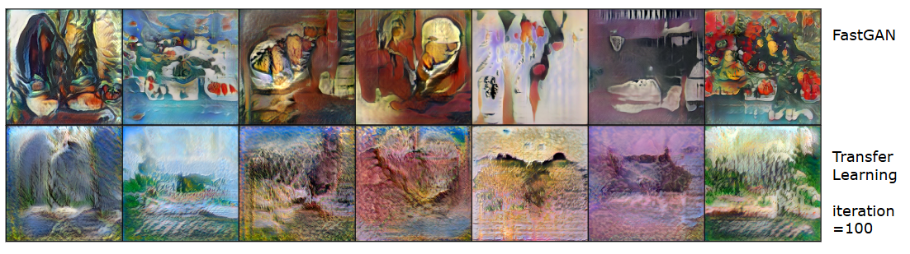
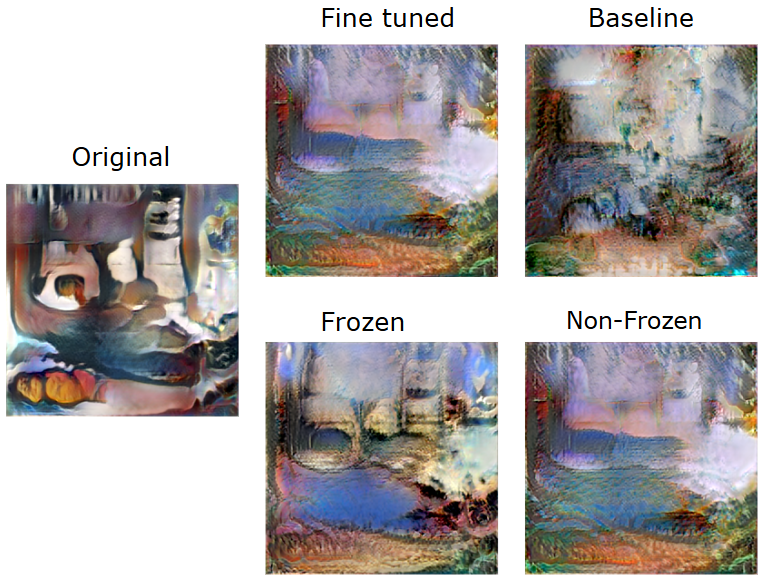

# FastGAN-based Transfer Learning for Style Transfer

## Introduction
Our project mainly involves using the [fastGAN](https://github.com/odegeasslbc/FastGAN-pytorch) code and implementing transfer learning on top of it.

This project shows how to perform Transfer Learning on pre-traind fastGAN model to do Neural Style Transfer. Our project transfer  artistic style to another style.

## Method
Show the work we do to perform Transfer Learning
### Freeze Layer
Typically, shallow convolutional layers affect features such as texture, color, and brush strokes, while deeper convolutional layers influence the contour and shape of the image. However, this is not always the case, so you still need to validate which layers to freeze for the best results.

Furthermore, identifying which layers to freeze depends on the model's structure. For example, FastGAN uses SLE (Skip-Layer Excitation) to connect features from both shallow and deep layers of the model.

### Fine Tune
To prevent overfit to new style,we don’t take the default
value of hyperparameter. We adjust the value of momen-
tum from 0.5 to 0. Besides, we add weight decay 0.003 as
shows in figure4. Meanwhile, we examine the training iter-
ation from 10 to 130. We choose iteration 100 because that
maximizes the preservation of the original image’s struc-
ture, color, and shape while still allowing it to learn the new
style as figure

###  Data Augmentation
After performing Transfer Learning, we find out that
model can’t generate specific color. After reviewing the
data, we found that our training dataset lacks a certain spe-
cific color. Therefore, we do data augmentation to enrich
color.

Data augmentation played a crucial role in
preserving the color of the content image. To achieve this,
we introduced red tones into the style image dataset, al-
lowing the model to learn and retain redness. Without this
augmentation, we observed that the model tended to shift
the colors toward green since Impressionism depicts nature
scenes so the color spectrum leans to green hue. We can
observe second row of below figure. After performing transfer
learning the color of picture seriously bias to green, whereas
after performing data augmentation, the image is closer to

First column is original images. Middle column is im-
ages after performing transfer learning without data augmentation.
Last Column is images apply transfer learning with data augmen-
tation

### Important notes
<ol>
<li> The implement of project is trans_learning.ipynb file
</ol>